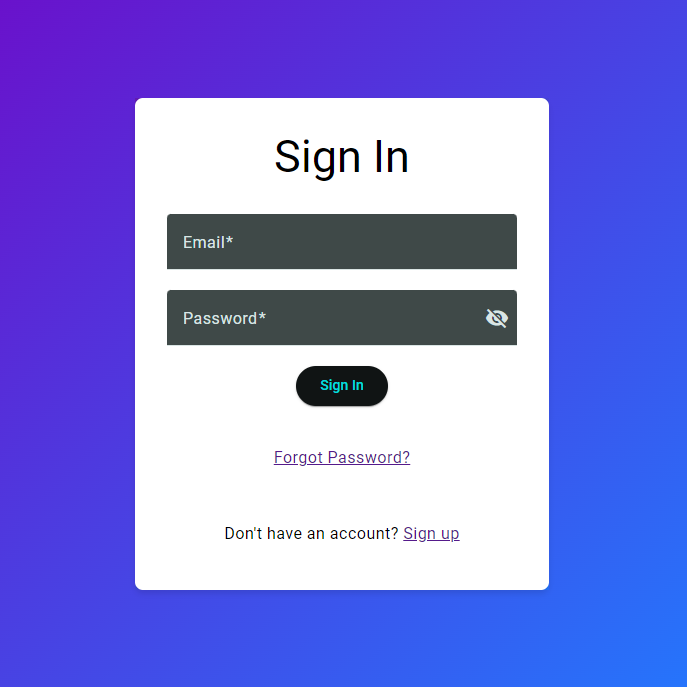

# MeanApp

## Overview

MeanApp is a responsive web application built using the MEAN stack. It allows users to create accounts, sign in, and sign out. The application also features a product listing page that is only accessible to logged-in users. The backend API is built with NestJS, and the frontend is built with Angular and NGRX for state management. The application uses MongoDB Atlas for the database and is deployed on Google Cloud Platform (GCP).

## Features

- User Signup
- User Signin
- User Signout
- 8-hour session management with automatic logout
- Forgot Password feature
- Product listing visible only to logged-in users
- Hosted on MongoDB Atlas
- Deployed on GCP

## Technology Stack

- **Frontend**: Angular, NGRX
- **Backend**: NestJS
- **Database**: MongoDB Atlas
- **Deployment**: Google Cloud Platform (GCP)
- **Monorepo Management**: Nx.dev

## Getting Started

### Prerequisites

- Node.js
- npm
- Angular CLI
- Nx CLI

### Installation

1. Clone the repository:
   ```sh
   git clone https://github.com/yourusername/mean-app.git
   cd mean-app
2. Install dependencies:
   ```sh
   npm install
3. Set up environment variables:
   ```sh
   export const environment = {
   production: false,
   apiUrl: 'http://localhost:8080/api'
   };
4. Set up MongoDB Atlas:
   - Create a MongoDB Atlas account and cluster.
   - Update the MongoDB connection string in apps/backend/src/app.module.ts
   ```sh
   MongooseModule.forRoot('your-mongodb-connection-string')
5. Running the frontend
  - Start the backend server:
     ```sh
     nx serve backend
  - Start the frontend server:
    ```sh
    nx serve backend
  - Open your browser and navigate to http://localhost:4200.
6. Delpyoment to Google Cloud Platform (GCP)
  - Build both the frontend & backend, build and push with docker and then lastly deploy on google cloud with a speciic region (Ex. me-west1)

## Preview

### Sign Up


### Sign In


### Products List


### Forgot Password


### Reset Password


## License
This project is licensed under the MIT License.
